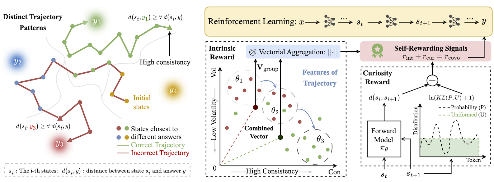
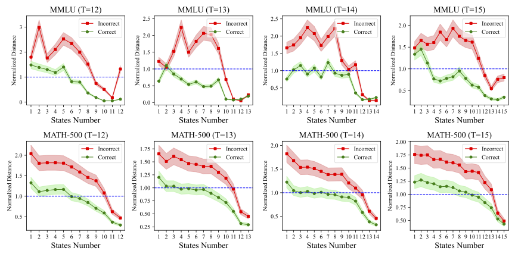

<h1 align="center"> Consistent Paths Lead to Truth: Self-Rewarding Reinforcement Learning for LLM Reasoning</h1>

<div align="center">
<a href='https://arxiv.org/abs/2506.08745'></a> 
<a href='https://huggingface.co/sastpg/Qwen2.5-3B-Instruct-CoVo'></a>
<a href='https://huggingface.co/datasets/sastpg/CoVo_Dataset'></a>
</div>

> [!NOTE]
> Official codebase for the paper "<b><a href="https://arxiv.org/pdf/2506.08745" style="color: #f08a5d;">Consistent Paths Lead to Truth: Self-Rewarding Reinforcement Learning for LLM Reasoning</a></b>". The training code is based on the [OpenRLHF](https://github.com/OpenRLHF/OpenRLHF) framework, and the evaluation code is based on the project [Math-Verify](https://github.com/huggingface/Math-Verify).

<div align="center">

</div>


## Overview
We propose a novel self-rewarding Reinforcement Learning (RL) framework to enhance Large Language Model (LLM) reasoning by leveraging the consistency of intermediate reasoning states across different response trajectories. Our key insight is that correct responses often exhibit consistent trajectory patterns in terms of model likelihood: their intermediate reasoning states tend to converge toward their own final answers *high consistency* with minimal deviation toward other candidates *low volatility*. Inspired by this observation, we introduce **CoVo**, an intrinsic reward mechanism that integrates *<u>**Co**</u>nsistency* and *<u>**Vo**</u>latility* via a robust vector-space aggregation strategy, complemented by a curiosity bonus to promote diverse exploration. CoVo enables LLMs to perform reinforcement learning in a self-rewarding manner, offering a scalable pathway for learning to reason without external supervision. Extensive experiments on diverse reasoning benchmarks show that CoVo achieves performance comparable to or even surpassing supervised RL.


> Normalized distance curve of correct and incorrect trajectories with varying state numbers.

## Reward Calculation
We first derive the two features (consistency and volatility) of a trajectory $\tau$ as follows:

$$
Con(\tau) = \frac{1}{T} \sum_{i=0}^{T-1} \mathbb{I} \left( \mathbf{D}[i,j] = \min_{0 \leq k < K} \mathbf{D}[i,k] \right).
$$

$$
Vol(\tau) = \frac{1}{T} \max \left \\{ i \mid \mathbf{D}[i,j] \neq \min_{0 \leq k < K} \mathbf{D}[i,k] \right \\}.
$$

Then we define the intrinsic reward and curiosity function as follows:

$$
r_{\text{int}}^{\mathbf{L}}  = \frac{1}{G} \cdot \sum_{i=0}^{G-1} \left( Con(\tau_i) - Vol(\tau_i) \right).
$$

$$
r_{\text{int}}^{\mathbf{V}} = \frac{1}{G} \sqrt{\left( \sum_{i=0}^{G-1} Con(\tau_i) \cos(Vol(\tau_i)) \right)^2 + \left( \sum_{i=0}^{G-1} Con(\tau_i) \sin(Vol(\tau_i)) \right)^2 }.
$$

$$
r_{\text{cur}} = -\frac{1}{|s_{i+1}|} \sum_{j=|s_i|}^{|s_{i+1}|} \log \pi_{\theta}(s_{i+1}[j] \mid s_{i+1}[: j]) - \ln [KL(P_{i+1}, \mathcal{U}) + 1].
$$

## Get Started
### Environmental Setup
We recommend using Python >= 3.10 with the following key packages using conda or docker:
- ray>=2.40.0
- torch>=2.5.1
- vllm>=0.7.2
- deepspeed>=0.15.0
- transformers>=4.48.3
- flash-attn==2.7.0.post2

For conda environment, you can run the following command to install the required packages:
```bash
cd CoVo/covo
conda create -n covo python=3.10
conda activate covo
pip install -r requirements.txt
```

For docker environment, you can run the following command to build the docker image and run the docker container:
```bash
cd CoVo/covo/dockerfile
docker pull nvcr.io/nvidia/pytorch:24.07-py3
docker build -t covo:v1.0 .  # build docker image
cd ../..
docker run --name covo --runtime=nvidia --gpus all -it --shm-size="32g" -v $PWD:/workspace covo:v1.0 bash
```
### Training
First, you need to prepare the [initial model weights](https://huggingface.co/Qwen/Qwen2.5-7B-Instruct) and download the instruction dataset from [this url](https://huggingface.co/datasets/sastpg/CoVo_Dataset), and put the data under the directory `CoVo/covo/dataset`.

After that, you can run the following command to start training:
```bash
ray start --head --node-ip-address 0.0.0.0  # start the ray cluster
sh examples/scripts/train_reinforce_qwen_ray_riv.sh  # training script
```
We provide the description of key parameters in the training script:

| Parameters                 | Description                                                  |
| -------------------------- | ------------------------------------------------------------ |
| `--pretrain`               | Absolute path to the pretrained model.                       |
| `--save_path`              | Absolute path to save the trained model.                     |
| `--prompt_data`            | Absolute path to instructions used for training.             |
| `--eval_data`              | Absolute path to evaluation dataset.                         |
| `--enable_accuracy_filter` | Filter the prompt that only have all the same sampled answers (*i.e.*, either too easy or too hard). |
| `--enable_curiosity`       | Use curiosity reward for training.                           |
| `--intrinsic_reward`       | Can only be `riv` or `ril` representing vectorial and linear aggression, respectively. |


### Evaluation
Please refer to `evaluation` directory for detailed evaluation methods. We provide evaluations across three different reasoning domains using 7 popular benchmarks:

| Reasoning Domain | Benchmarks                          |
| ---------------- | ----------------------------------- |
| Mathematics      | MATH-500,AMC, GSM8K, Olympiad Bench |
| Commonsense      | MMLU-Pro, CommonsenseQA             |
| Science          | GPQA                                |

## Citation
If you find this repository is useful, please star🌟 this repo and cite🔗 our paper.
```
@article{zhang2025consistent,
  title={Consistent Paths Lead to Truth: Self-Rewarding Reinforcement Learning for LLM Reasoning},
  author={Zhang, Kongcheng and Yao, Qi and Liu, Shunyu and Wang, Yingjie and Lai, Baisheng and Ye, Jieping and Song, Mingli and Tao, Dacheng},
  journal={arXiv preprint arXiv:2506.08745},
  year={2025}
}
```


## Acknowledgement
We thank the [OpenRLHF](https://github.com/OpenRLHF/OpenRLHF) for providing the awesome open-source RL infrastructure. We also thank the developers of [Qwen](https://github.com/QwenLM), [Llama](https://github.com/meta-llama) and [DeepSeek-R1](https://github.com/deepseek-ai/DeepSeek-R1) for their innovation and contribution to the open-source community.